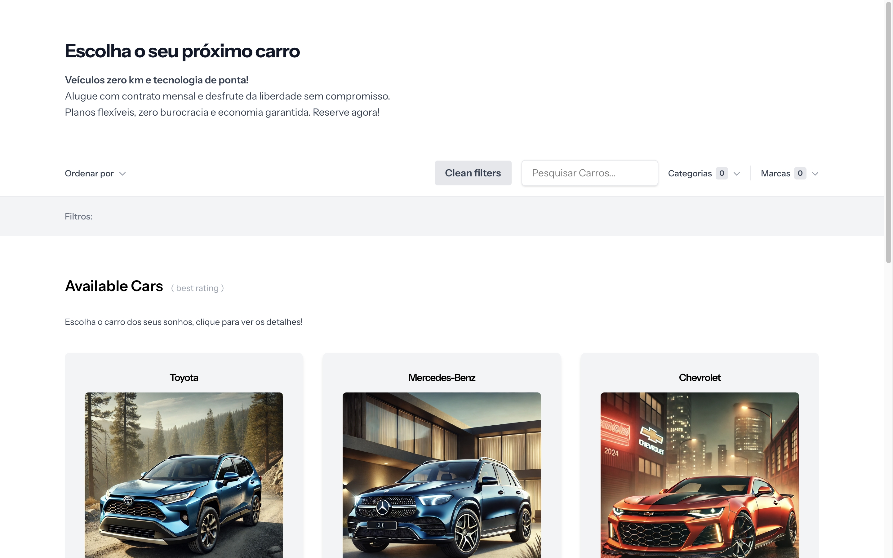
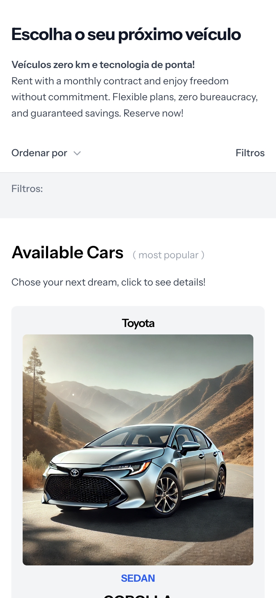
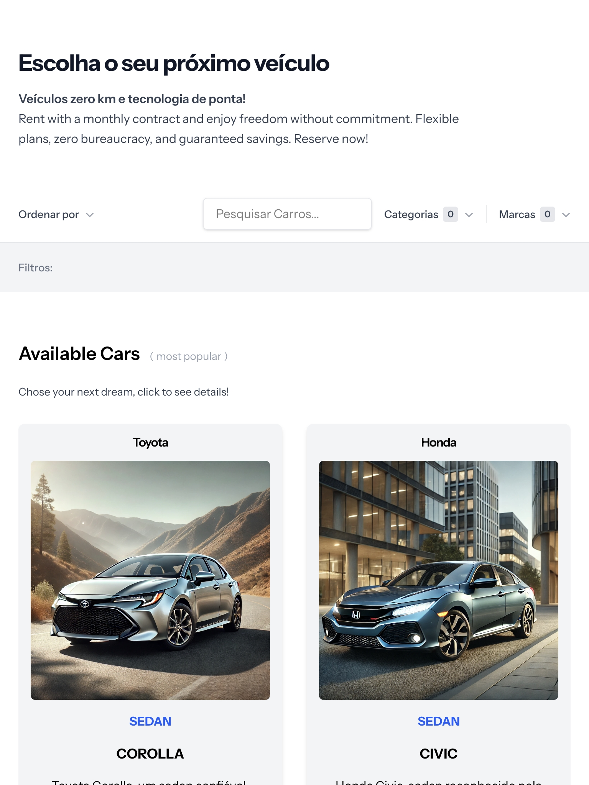
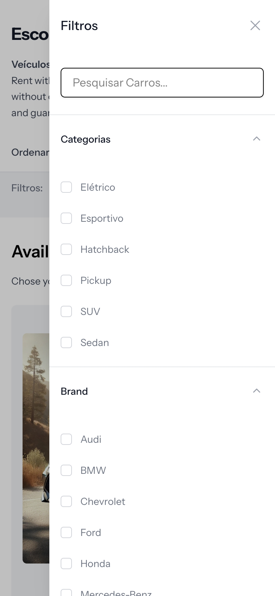
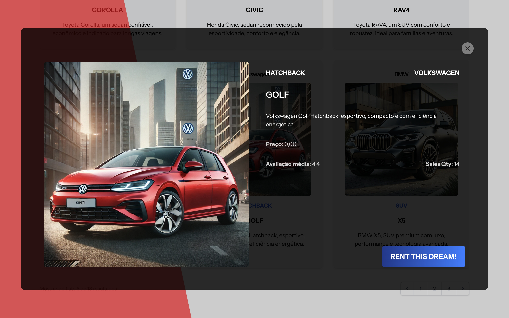

# Projeto Venice - Laravel & Livewire

Este repositório contém um mecanismo de busca com filtros combinados implementado com Laravel e Livewire, utilizando
Docker e Laravel Sail.

## 💡Pré-requisitos

Você precisa **apenas do Docker e Docker Compose** instalados:

- Docker: [https://docs.docker.com/get-docker/](https://docs.docker.com/get-docker/)
- Docker Compose (já incluso nas versões recentes do Docker)

## 🚀 Passo a passo para rodar o projeto

### 1. Clone o repositório

```shell
git clone <url-do-repositorio>
cd nome-do-repositorio
```

### 2. Instalar dependências com Docker

Como você não tem PHP ou Composer instalados localmente, use o Docker para realizar o comando inicial do composer:

```shell
docker run --rm \
-u "$(id -u):$(id -g)" \
-v $(pwd):/var/www/html \
-w /var/www/html \
composer:latest composer install --ignore-platform-reqs
```

Este comando instalará as dependências diretamente via Docker.

### 3.Inicializar Laravel Sail

Agora, inicialize o ambiente Docker utilizando Laravel Sail:

```shell
./vendor/bin/sail up -d
```

Se preferir, crie um alias no seu terminal:

```shell
alias sail='./vendor/bin/sail'
```

Então poderá usar apenas:

```shell
sail up -d
```

### 4. Configurar o ambiente

    Copie o arquivo .env.example e gere a chave da aplicação:
    
    ```shell
    sail artisan key:generate
    ```

### 5. Migrar o banco e gerar seeders

    Rode as migrações e carregue dados iniciais usando factories e seeders:

    ```shell
    sail artisan migrate --seed
    ```

### 6. Acessar o projeto

    Abra seu navegador em: http://localhost

## Comandos úteis

Parar containers:

```shell
sail down
```

Rodar testes automatizados:

```shell
sail artisan test
```

## 📂 Estrutura do Projeto

* Migrations: Estrutura das tabelas
* Factories: Criação de dados de teste
* Seeders: Dados iniciais do banco
* Livewire Components: Componentes para busca e filtragem

## 📸 Screenshots

### Tela inicial:



### Filtros versão Mobile e Tablet:




### Tela de filtros Mobile:



### Página de detalhes do carro:




